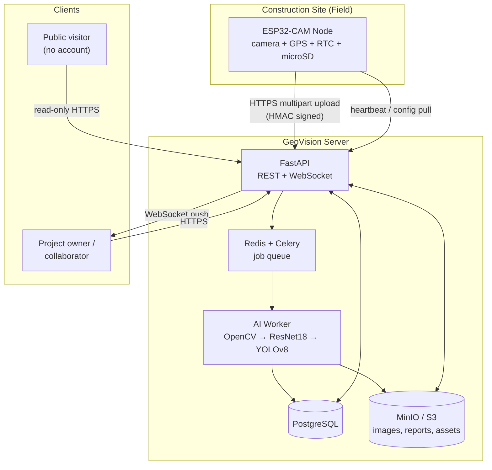
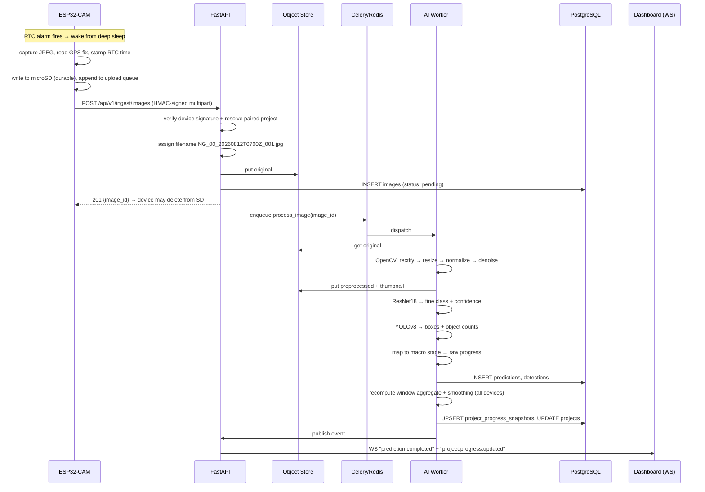

# GeoVision — Master Architecture (Finalized)

**GeoVision: Smart Construction Monitoring Using AI and Geotagging**
Undergraduate Computer Engineering thesis — hardware + software system.

This note supersedes the original prompt-level architecture and the later dashboard/UX
addendum. Where the two conflicted, the reconciliation is recorded in
[[ADR-Index]] and marked **⚖ Reconciled** below.

---

## 1. System Overview

### 1.1 Context diagram



### 1.2 The five planes

| Plane | Responsibility | Lives in |
|---|---|---|
| **Edge** | capture, geotag, buffer, upload | `firmware/` — [[ESP32-CAM-Node]] |
| **Ingestion** | authenticate device, name + store image, enqueue | `backend/` — [[Module-05-Device-Pairing-and-Ingestion]] |
| **Intelligence** | preprocess, classify, detect, score progress | `ai/` — [[Module-06-AI-Preprocessing]] → [[Module-09-Inference-Service]] |
| **Persistence** | projects, users, predictions, snapshots, reports | PostgreSQL + object storage — [[Domain-Model]] |
| **Presentation** | public site + authenticated dashboard | `dashboard/` — [[Module-11-Public-Dashboard]], [[Module-12-Owner-Dashboard]] |

---

## 2. Architectural Principles

1. **Clean Architecture / Ports & Adapters.** `domain` (entities, rules) ← `application`
   (use cases) ← `infrastructure` (SQLAlchemy, MinIO, torch) ← `api` (FastAPI routers).
   Dependencies point *inward only*. The progress algorithm must be unit-testable with no
   database and no torch import.
2. **Repository Pattern.** Every persistence access goes through an interface
   (`ProjectRepository`, `ImageRepository`, …) defined in `domain/repositories/` and
   implemented in `infrastructure/persistence/`.
3. **Dependency Injection.** FastAPI `Depends` wires concrete repositories and services;
   tests inject fakes. No module constructs its own database session.
4. **SOLID.** Notably: the classifier, the detector, and the progress estimator each sit
   behind an interface so a MobileNetV3 or a future model swaps in without touching callers.
5. **The AI is advisory, the owner is authoritative.** The model never marks a project
   complete; it can only reach 80% and request human inspection. This is a deliberate
   safety property and a defensible thesis design decision. See [[Progress-Calculation]].
6. **Everything is typed and documented.** Python type hints + docstrings on every public
   function; TypeScript strict mode on the frontend; PEP 8 via `ruff` + `black`.
7. **Fail-soft on the edge.** The camera never loses a capture because the network is down —
   microSD is the source of truth until the server ACKs.

---

## 3. Reconciled Design Decisions ⚖

These are the points where the original architecture and the dashboard addendum disagreed.
Each is resolved here and cross-referenced to an ADR.

| # | Conflict | Resolution |
|---|---|---|
| 1 | Original: **10 classes**. Addendum: **4 stages × 20% + 20% approval**. | Keep **both**, in two layers. The CNN classifies **10 fine-grained classes** (the ML problem). A deterministic mapping table folds those into **4 macro stages + approval** (the UX/business problem). Neither is discarded. → [[Construction-Stages]], ADR-001 |
| 2 | Original naming `GV_[PROJECT]_[STAGE]_[NUM].jpg`. Addendum naming `NG_00_<timestamp>_<seq>.jpg`. | Two **separate namespaces**: the `GV_*` form is the *dataset/training* namespace (stage is known because it is a label); the `<CODE>_<TS>_<SEQ>` form is the *runtime capture* namespace (stage is unknown at capture time — it is the thing being predicted). → [[Naming-Conventions]], ADR-002 |
| 3 | Professor suggested **WebSocket for upload**. | Images upload over **HTTPS multipart POST** (robust, resumable, works with ESP32 deep-sleep and constrained RAM). WebSocket is used for **server → dashboard live push** — which is what "the owner shouldn't have to refresh" actually requires — and for an optional device control channel. The professor's requirement is satisfied; the transport choice is justified. → [[Realtime-Events]], ADR-003 |
| 4 | Original: single-image prediction. Addendum: multiple cameras averaged. | Progress is computed per **capture window** (default: per day) as a **weighted aggregate across camera faces**, not per image. A single image never moves the headline number. → [[Progress-Calculation]], ADR-004 |
| 5 | Original: flat "progress %". Addendum: status = inactive/offline/delayed/completed. | Progress and **status** are separate derived fields with separate rules. → [[Project-Status-Rules]] |
| 6 | Images in DB vs object store. | Binary never enters PostgreSQL. Object storage (MinIO in dev/Docker, S3-compatible in prod) holds originals, preprocessed frames, thumbnails, reference assets, and generated reports. The DB holds keys. → ADR-005 |

---

## 4. End-to-End Data Flow



**Failure branches** (all must be implemented, not just diagrammed):
- No Wi-Fi at capture time → image stays on microSD, retried at next wake and on a
  dedicated retry window. Backlog uploads carry their **original** `captured_at`.
- Upload succeeds but AI fails → `images.status = 'failed'`, retried with exponential
  backoff up to 3 attempts, then surfaced on the device/health panel.
- Low-confidence prediction (`< 0.60`) → stored, flagged `low_confidence`, **excluded**
  from stage advancement but shown in the image feed.
- Duplicate upload (same `sha256` + device + capture time) → idempotent 200, no reprocess.

---

## 5. AI Pipeline (canonical)

```
Capture (ESP32-CAM, fixed angle)
   ↓
Upload + geotag metadata (lat, lon, captured_at)
   ↓
OpenCV Preprocessing            ── ai/preprocessing/
   ├─ perspective transform (per-device stored homography → canonical façade view)
   ├─ resize to 224×224 (classifier) / 640×640 (detector)
   ├─ brightness + white-balance normalization (CLAHE on L channel, LAB space)
   └─ noise reduction (bilateral filter; optional rain/haze rejection)
   ↓
ResNet18 transfer learning      ── ai/models/classifier/
   → fine class ∈ 10 classes, softmax confidence
   ↓
Stage mapping + progress model  ── ai/progress/
   → macro stage ∈ {Foundation, Framing, Roofing, Finishing, Approval}
   → raw progress % (0–80 machine ceiling)
   ↓
YOLOv8 detection (comparison / corroboration) ── ai/models/detector/
   → boxes, confidences, object counts (columns, walls, roof, steel bars,
     scaffolding, workers, equipment)
   ↓
Temporal aggregation            ── ai/progress/aggregator.py
   → multi-camera weighted mean → EMA smoothing → monotonic ratchet
   ↓
PostgreSQL (predictions, detections, snapshots)
   ↓
Dashboard (WebSocket push + REST)
```

**MobileNetV3** is trained as a **comparison backbone** only (accuracy vs. inference time vs.
model size), reported in the thesis evaluation chapter — it is not in the serving path.
See [[Evaluation-Plan]].

---

## 6. Backend Architecture

```
backend/app/
  domain/           # pure Python. entities, value objects, enums, repo interfaces,
                    # progress rules. NO imports of fastapi/sqlalchemy/torch.
  application/      # use cases: CreateProject, PairDevice, IngestImage,
                    # RecomputeProgress, GenerateReport, ... one class each
  infrastructure/   # sqlalchemy models + repo impls, minio client, celery tasks,
                    # ai client adapter, pdf/csv writers, security (jwt, hmac)
  api/              # FastAPI routers, pydantic schemas, dependencies, ws hub
  core/             # settings (pydantic-settings), logging, exceptions
```

- **Auth:** JWT access (15 min) + refresh (7 d, rotating, stored hashed). Passwords with
  Argon2id. Devices authenticate with HMAC-SHA256, never with JWT — see
  [[Device-Pairing-Protocol]].
- **Authorization:** two independent axes — a user's *professional role* (self-declared at
  registration, descriptive) and their *project membership role* (authoritative for
  permissions). See [[Roles-and-Permissions]].
- **Async work:** Celery workers on Redis. Queues: `ingest` (fast), `inference` (GPU/CPU
  bound), `reports` (slow). The API process never runs torch.
- **Migrations:** Alembic, one revision per module.

---

## 7. Frontend Architecture

React 18 + TypeScript + Vite, TanStack Query for server state, Zustand for UI state,
React Router, Tailwind + shadcn/ui, Recharts for the timeline graph, MapLibre GL for maps.

```
dashboard/src/
  app/          routes, providers, guards (PublicRoute / ProtectedRoute)
  features/     auth, projects, devices, images, progress, reports, search, profile
                (each: api.ts, hooks.ts, components/, types.ts)
  components/   shared UI primitives
  lib/          api client, ws client, formatters, geo helpers
```

### Public surface (no account)
Homepage feed of **public** projects (thumbnail of latest image, GPS, timestamp, progress) ·
Project Folder page (progress, timeline graph, handler, everything marked public, external
map link to the coordinates) · Public owner profile · Search (owner / location / project
name) · Contact Us · Login / Register.

### Authenticated surface
Own profile (name, role, optional company, project list with status badges, **Create
Project**) · Project Folder (progress, timeline, deadline, status, per-stage %, recent
geotagged uploads, remarks, upload references, **Pair ESP32**, **Report**, collaborators,
devices) · plus everything the public surface offers.

Full page-by-page spec: [[Module-11-Public-Dashboard]], [[Module-12-Owner-Dashboard]].

---

## 8. Repository Layout (top level)

See [[Repository-Structure]] for the full tree.

```
GeoVision-Project/
├── GeoVision-Vault/     ← this vault (source of truth)
├── ai/                  ← training, preprocessing, inference, evaluation
├── backend/             ← FastAPI service
├── dashboard/           ← React app
├── firmware/            ← ESP32-CAM (PlatformIO / Arduino)
├── dataset/             ← raw, processed, augmented, labels, metadata
├── models/              ← checkpoints + exported weights (git-lfs / ignored)
├── outputs/             ← runs, logs, confusion matrices, generated reports
├── scripts/             ← dataset prep, seeding, benchmarks
├── tests/               ← integration + e2e (unit tests live beside code)
├── docker/              ← Dockerfiles + compose
├── documentation/       ← generated API docs, diagrams exported for print
└── thesis/              ← manuscript chapters, figures, defense materials
```

---

## 9. Non-Functional Requirements

| Concern | Target |
|---|---|
| Inference latency | < 1.5 s/image CPU, < 300 ms GPU (ResNet18 + YOLOv8n) |
| Ingest → dashboard update | < 10 s end-to-end |
| Classifier accuracy | ≥ 85 % top-1 on held-out test set (thesis target) |
| Device battery | ≥ 14 days on 10 000 mAh at 2 captures/day |
| Upload payload | ≤ 500 KB/image (SVGA/UXGA JPEG q≈12) |
| Availability | single-node acceptable for defense; documented HA path |
| Data retention | originals retained for project lifetime + 1 year |

## 10. Security

- TLS everywhere; HMAC device auth with nonce + timestamp replay window (±5 min).
- Pairing tokens: single-use, 15-min TTL, stored **hashed**, exchanged for a long-lived
  per-device secret that is shown exactly once.
- Private projects and private profiles are enforced in the **repository/query layer**, not
  only in the UI — a public endpoint physically cannot select private rows.
- Uploaded reference assets are validated by magic bytes, size-capped, and served via
  signed, expiring URLs.
- Rate limits on `/auth/*`, `/ingest/*`, and search.

---

## 11. Build Order

Do **not** build everything at once. One module per iteration, each with: folder structure,
explanation, source code, dependencies, how to run, testing procedure, expected output.
The sequence and dependencies are in [[Build-Order]].

---

## Related
[[Repository-Structure]] · [[Tech-Stack]] · [[Domain-Model]] · [[Progress-Calculation]] ·
[[API-Contract]] · [[Device-Pairing-Protocol]] · [[ADR-Index]]
