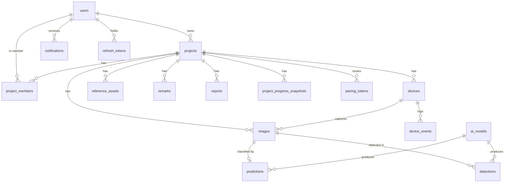

# Domain Model & PostgreSQL Schema

All PKs are `UUID` (v4, `gen_random_uuid()` via `pgcrypto`). All timestamps are
`TIMESTAMPTZ` stored in **UTC**. All enums are PostgreSQL native enums, mirrored in
`backend/app/domain/enums.py` (single definition, imported everywhere).

## ERD



---

## Enums

```sql
professional_role : 'manager','project_handler','engineer','architect','foreman',
                    'contractor','surveyor','home_owner','student','other'
visibility        : 'public','private'
project_status    : 'active','inactive','delayed','completed','archived'
approval_state    : 'not_ready','awaiting_inspection','approved'
membership_role   : 'owner','manager','engineer','editor','collaborator','employee','viewer'
membership_status : 'pending','accepted','revoked'
camera_face       : 'front','front_diagonal','back','back_diagonal'
device_status     : 'unpaired','paired','online','offline','revoked'
image_source      : 'device','manual_upload','backfill'
image_status      : 'pending','preprocessed','inferred','rejected','failed'
macro_stage       : 'foundation','framing','roofing','finishing','approval'
asset_kind        : 'blueprint','render_3d','reference_photo','document','inspection_photo'
remark_type       : 'system','weather','delay','inactivity','manual','regression'
severity          : 'info','warning','critical'
report_kind       : 'weekly','monthly','custom'
report_format     : 'pdf','csv'
report_status     : 'queued','processing','ready','failed'
model_kind        : 'classifier','detector'
notification_type : 'inspection_required','delay','device_offline','collab_invite',
                    'report_ready','regression'
```

---

## Tables

### `users`
| column | type | notes |
|---|---|---|
| id | uuid pk | |
| username | citext unique | 3–30, `^[a-zA-Z0-9_.]+$` |
| email | citext unique | |
| password_hash | text | Argon2id |
| full_name | text | |
| professional_role | professional_role | declared at registration |
| company | text null | optional, editable later |
| bio | text null | |
| avatar_key | text null | object-store key |
| profile_visibility | visibility | default `public` (B.5) |
| is_active | bool | default true |
| email_verified_at | timestamptz null | |
| created_at / updated_at | timestamptz | |

### `refresh_tokens`
`id, user_id fk, token_hash, expires_at, revoked_at null, user_agent, ip, created_at`
Rotating; reuse of a revoked token revokes the whole family.

### `projects`
| column | type | notes |
|---|---|---|
| id | uuid pk | |
| owner_id | uuid fk users | creator; also gets a `project_members` row with `owner` |
| name | text | e.g. "Jollibee Branch — Naga" |
| description | text null | |
| project_code | text unique | `NG_00` — see [[Naming-Conventions]] |
| intended_use | text null | "what the building is for" (public-facing) |
| location_label | text | human address |
| latitude / longitude | numeric(9,6)/(9,6) | drives map + external link |
| start_date | date | |
| deadline_date | date | contract/estimated deadline |
| worker_count | int null | skippable, editable later |
| visibility | visibility | public ⇒ appears on homepage feed |
| status | project_status | derived — [[Project-Status-Rules]] |
| approval_state | approval_state | default `not_ready` |
| progress_pct | numeric(5,2) | denormalized latest `displayed_pct` |
| macro_stage | macro_stage null | denormalized |
| window_mode | text | `daily` \| `weekly`, default `daily` |
| timezone | text | IANA, default `Asia/Manila` |
| last_capture_at | timestamptz null | |
| completed_at | timestamptz null | |
| approved_by / approved_at / inspection_notes | | audit of the final 20% |
| created_at / updated_at | | |

Indexes: `(visibility, status)`, `(owner_id)`, GiST/btree on `(latitude, longitude)`,
trigram index on `name` and `location_label` for search.

### `project_members`
`id, project_id fk, user_id fk, membership_role, membership_status, invited_by fk users,
invited_at, responded_at, created_at` — unique `(project_id, user_id)`.
Implements **B.6 collaboration**. Permissions per role: [[Roles-and-Permissions]].

### `devices`
| column | type | notes |
|---|---|---|
| id | uuid pk | |
| project_id | uuid fk | |
| device_name | text unique | `ESP_NG_00_FD` (auto-generated) |
| face | camera_face | |
| weight | numeric(3,2) | default per face — [[Progress-Calculation]] |
| secret_hash | text | HMAC device secret (Argon2/SHA-256), shown once |
| status | device_status | |
| firmware_version | text null | |
| hardware_id | text null | ESP32 efuse MAC, bound at first auth |
| capture_schedule | jsonb | `{"times":["07:00","16:00"],"tz":"Asia/Manila"}` |
| homography | jsonb null | 4 src points → canonical rect, for perspective transform |
| roi_polygon | jsonb null | façade region of interest for occlusion check |
| last_seen_at | timestamptz null | |
| last_battery_mv / last_rssi_dbm | int null | |
| paired_at / revoked_at | timestamptz null | |
| created_at / updated_at | | |

Unique `(project_id, face)`.

### `pairing_tokens`
`id, project_id fk, face camera_face, token_hash, display_code (8 chars, shown as text+QR),
expires_at (15 min), used_at null, used_by_device_id null, created_by fk users, created_at`
See [[Device-Pairing-Protocol]].

### `images`
| column | type | notes |
|---|---|---|
| id | uuid pk | |
| project_id / device_id | uuid fk (device nullable for manual uploads) | |
| filename | text | `NG_00_20260812T070000Z_001.jpg` |
| storage_key / preprocessed_key / thumb_key | text | |
| source | image_source | |
| status | image_status | |
| captured_at | timestamptz | **device time** (RTC), used for windowing |
| uploaded_at | timestamptz | server time |
| seq_number | int | daily sequence |
| latitude / longitude | numeric(9,6) null | GPS fix at capture |
| gps_accuracy_m / altitude_m / satellites | | fix quality |
| width / height / size_bytes | int | |
| sha256 | text | idempotency, unique `(project_id, sha256)` |
| exif | jsonb | |
| quality_flags | jsonb | `{"blur":41.2,"dark":false,"occluded":false}` |
| rejected_reason | text null | |
| created_at | | |

Indexes: `(project_id, captured_at DESC)`, `(device_id, captured_at DESC)`, `(status)`.

### `predictions`
`id, image_id fk unique, model_id fk ai_models, fine_class_index int, fine_class text,
confidence numeric(4,3), class_probabilities jsonb, macro_stage, raw_progress_pct numeric(5,2),
is_eligible bool, low_confidence bool, inference_ms int, created_at`

### `detections`
`id, image_id fk, model_id fk, class_name text, confidence numeric(4,3),
bbox_x/bbox_y/bbox_w/bbox_h numeric(6,5) (normalized xywh), created_at`
Plus `detection_summaries`: `image_id unique, counts jsonb, total_objects int, inference_ms`.
YOLO classes: `column, wall, roof, steel_bar, scaffolding, worker, equipment`.

### `project_progress_snapshots`
`id, project_id fk, window_start timestamptz, window_end, raw_pct, ema_pct, displayed_pct,
macro_stage, foundation_pct, framing_pct, roofing_pct, finishing_pct, approval_pct,
contributing_image_ids uuid[], device_weights jsonb, eligible_image_count int,
algorithm_version text, created_at` — unique `(project_id, window_start)`.
**Source of the timeline graph.**

### `reference_assets`
`id, project_id fk, uploaded_by fk users, kind asset_kind, storage_key, original_filename,
mime_type, size_bytes, notes, is_public bool, created_at` — the "upload 3D render / blueprint
/ reference" button.

### `remarks`
`id, project_id fk, author_id fk users null (null ⇒ system), remark_type, severity, message,
is_public bool, effective_from date null, effective_to date null, created_at`
Used for "delayed / inactive / typhoon expected / rework detected".

### `reports`
`id, project_id fk, requested_by fk users, kind, format, period_start, period_end, status,
storage_key null, error text null, requested_at, completed_at`

### `ai_models`
`id, name, kind, architecture, version, framework ('pytorch'|'ultralytics'), weights_key,
class_names jsonb, input_size, metrics jsonb (accuracy/P/R/F1/mAP/latency), is_active bool,
trained_at, created_at` — powers `GET /model/status`. Exactly one `is_active` per `kind`
(partial unique index).

### `device_events`
`id, device_id fk, event_type text ('boot','heartbeat','upload','error','sleep','ota'),
payload jsonb, battery_mv, rssi_dbm, created_at` — device health timeline.

### `notifications`
`id, user_id fk, project_id fk null, notification_type, title, body, read_at null, created_at`

### `audit_logs`
`id, actor_user_id null, actor_device_id null, action text, entity_type, entity_id,
metadata jsonb, ip, created_at` — pairing, approval, visibility changes, member changes.

---

## Visibility enforcement (critical)

Public read paths use dedicated repository methods that **hard-filter in SQL**:

```sql
-- public project feed
WHERE projects.visibility = 'public' AND projects.status <> 'archived'
-- public profile
WHERE users.profile_visibility = 'public' AND users.is_active
```

A private profile that is searched still returns `{username, "This account is private"}` and
nothing else — no project list, no counts. There must be an integration test asserting a
private project's images are 404 (not 403) to anonymous callers.

## Migrations

One Alembic revision per module, named `mXX_<slug>`. Never edit a merged revision.

## Related
[[Roles-and-Permissions]] · [[Project-Status-Rules]] · [[API-Contract]] · [[Module-02-Database-Schema]]
