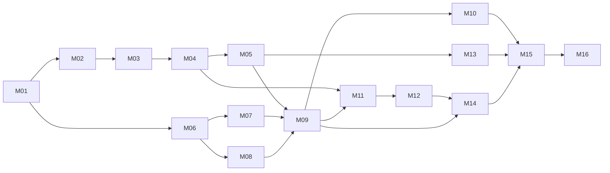

# Build Order

> **Rule: one module per iteration.** Every module delivers all seven artifacts:
> **1** folder structure · **2** explanation · **3** source code · **4** dependencies ·
> **5** how to run · **6** testing procedure · **7** expected output.
> Do not start module *n+1* until module *n*'s tests pass and its `status:` is `done`.

## Sequence

| # | Module | Depends on | Ships when |
|---|---|---|---|
| 01 | [[Module-01-Foundation-Setup]] | — | repos, Docker, config, CI skeleton up |
| 02 | [[Module-02-Database-Schema]] | 01 | all tables migrated, seeded |
| 03 | [[Module-03-Auth-and-Users]] | 02 | register/login/profile/visibility |
| 04 | [[Module-04-Projects-and-Folders]] | 03 | create project, folder payload, members, remarks |
| 05 | [[Module-05-Device-Pairing-and-Ingestion]] | 04 | pairing token/QR, HMAC ingest, simulator uploads |
| 06 | [[Module-06-AI-Preprocessing]] | 01 | OpenCV pipeline + quality gate, unit-tested |
| 07 | [[Module-07-Classifier-Training]] | 06 | trained ResNet18 + MobileNetV3, checkpoints, metrics |
| 08 | [[Module-08-YOLO-Detection]] | 06 | trained YOLOv8, detection outputs |
| 09 | [[Module-09-Inference-Service]] | 05,07,08 | end-to-end: upload → prediction → progress in DB |
| 10 | [[Module-10-Reports-and-Remarks]] | 09 | PDF/CSV reports, status derivation, system remarks |
| 11 | [[Module-11-Public-Dashboard]] | 04,09 | homepage feed, public folder, search, contact |
| 12 | [[Module-12-Owner-Dashboard]] | 11 | auth UI, create project, folder, pairing modal, devices |
| 13 | [[Module-13-Firmware]] | 05 | real ESP32 capturing, geotagging, uploading |
| 14 | [[Module-14-Realtime]] | 09,12 | WebSocket push, live dashboard updates |
| 15 | [[Module-15-Testing-and-Evaluation]] | all | full test suite + every thesis metric/figure |
| 16 | [[Module-16-Deployment]] | all | one-command compose deploy, docs, demo script |

## Dependency graph

## Parallel tracks (if working with a partner or in spare time)

- **Track A (backend):** 01 → 02 → 03 → 04 → 05 → 09 → 10
- **Track B (AI):** 01 → 06 → 07 → 08 *(needs the dataset — start collecting on day 1)*
- **Track C (frontend):** 11 → 12 → 14 *(mock the API from [[API-Contract]] until 04 lands)*
- **Track D (hardware):** 13 *(order parts on day 1; lead time is the real risk)*

## Critical-path warnings

1. **Dataset collection is the long pole.** Start gathering and annotating images during
   Module 01, not Module 07. A model cannot be trained the week before the defense.
2. **Order hardware immediately.** ESP32-CAM, GPS, DS3231, and the enclosure have shipping
   lead times that no amount of coding speeds up.
3. **Use `scripts/simulate_device.py`** so modules 05→12 are fully testable before a single
   wire is soldered.
4. **Deploy the camera on a real site as early as possible** — real captures are what make
   this a thesis rather than a demo, and they need weeks of calendar time to accumulate.

## Status board

| Module | Status | Started | Finished | Notes |
|---|---|---|---|---|
| 01 | ✅ **done** | 2026-08-13 | 2026-08-13 | Audited before building; ADR-011…014 recorded. 59 tests green, 4 import contracts kept. Docker Desktop still to install (Q9). |
| 02 | ▶ **next** | | | Needs a running PostgreSQL |
| 03 | planned | | | |
| 04 | planned | | | |
| 05 | planned | | | |
| 06 | planned | | | |
| 07 | planned | | | |
| 08 | planned | | | |
| 09 | planned | | | |
| 10 | planned | | | |
| 11 | planned | | | |
| 12 | planned | | | |
| 13 | planned | | | |
| 14 | planned | | | |
| 15 | planned | | | |
| 16 | planned | | | |

Keep this table current — it is the fastest way for a new session to know where things stand.
Longer entries go in [[Progress-Log]].

## Related
[[00-START-HERE]] · [[Master-Architecture]] · [[Repository-Structure]]
