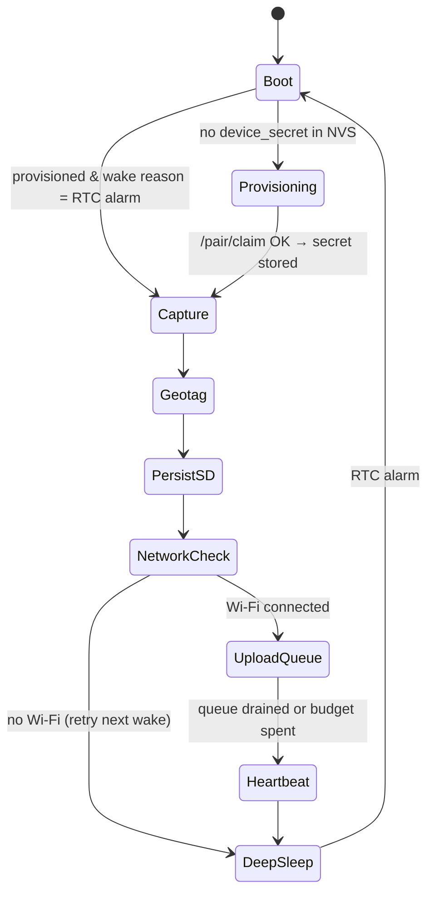

# ESP32-CAM Capture Node

## Bill of materials (per node)

| Item | Part | Notes |
|---|---|---|
| MCU + camera | AI-Thinker ESP32-CAM (OV2640, 2 MP) | PSRAM required for UXGA framebuffer |
| Programmer | FTDI / CP2102 USB-TTL 3.3 V | flashing only |
| GPS | u-blox NEO-6M or NEO-M8N + patch antenna | UART, TinyGPS++ |
| RTC | DS3231 + CR2032 | I²C; wake alarm + trusted timestamp when GPS has no fix |
| Storage | microSD 16–32 GB, class 10 | SD_MMC **1-bit** mode (frees GPIO4/12/13) |
| Power | 10 000 mAh power bank **or** 18650 + TP4056 + MT3608/AMS1117 | see [[Capture-Schedule-and-Power]] |
| Optional | small solar panel + charge controller | long deployments |
| Enclosure | IP65 box, clear window, silica gel, cable glands | outdoor site, tropical rain |
| Mount | pole/scaffold clamp, **rigid** | fixed angle is an architectural assumption |

> ⚠ **Fixed angle is a hard requirement.** The stored homography, the ROI occlusion mask,
> and the whole "same viewpoint over time" premise depend on the camera not moving. Mount
> rigidly, mark the bracket position, and photograph the installation for the thesis.

### Pin notes (AI-Thinker)
- Camera uses most GPIOs. Free-ish: **GPIO12, GPIO13** (avoid GPIO12 at boot — strapping),
  **GPIO14/15/2/4** are SD in 4-bit mode → use **1-bit SD** to reclaim.
- GPS UART → `GPIO13` (RX), `GPIO12` (TX) via `HardwareSerial(1)`, or software serial.
- DS3231 I²C → `GPIO14` (SDA), `GPIO15` (SCL). DS3231 `INT/SQW` → `GPIO33`/RTC-capable pin
  for `esp_sleep_enable_ext0_wakeup`. **Verify against your actual board revision and
  record the final pinout here.** ([[Open-Questions]])
- GPIO0 must be LOW only while flashing.
- Onboard LED/flash is GPIO4 — conflicts with SD in 4-bit mode; another reason for 1-bit.

## Firmware state machine



### Step detail

1. **Boot** — read wake cause. Init PSRAM, camera, I²C (DS3231), SD, NVS.
2. **Provisioning** — if NVS has no `device_secret`: start SoftAP `GeoVision-Setup-XXXX`
   with a captive page for Wi-Fi SSID/password + the 8-char pairing code (or accept a
   serial-flashed config). Then `POST /pair/claim`. Store `device_id`, `device_secret`,
   `device_name`, `project_code`, `capture_schedule` in NVS. See
   [[Device-Pairing-Protocol]].
3. **Capture** — warm up the sensor (discard the first 2–3 frames; the OV2640 needs AE/AWB
   to settle or you get a green/dark frame), then grab a JPEG.
   Config: `FRAMESIZE_SVGA` (800×600) or `UXGA` (1600×1200), `jpeg_quality = 12`,
   `fb_count = 2`. Target ≤ 500 KB.
4. **Geotag** — read GPS for up to 60 s (cold fix can take minutes; use the last known fix
   if the timeout expires and flag `gps_stale`). Timestamp priority:
   **GPS UTC → DS3231 → server-corrected estimate**. Record `satellites` and `hdop`.
5. **PersistSD** — write `/queue/<epoch>_<seq>.jpg` **plus** a `.json` sidecar with
   `captured_at`, lat/lon, accuracy, battery mV, RSSI, sha256. **The SD write happens
   before any network attempt.** No capture is ever lost to a network failure.
6. **NetworkCheck** — connect Wi-Fi with a 20 s timeout; on failure go straight to sleep.
7. **UploadQueue** — upload oldest-first (backlog preserves original `captured_at`), signed
   per [[Device-Pairing-Protocol]]. On `201` or `200 duplicate`, move the file to
   `/sent/` (or delete when SD is > 80 % full). Cap at `MAX_UPLOADS_PER_WAKE = 10` and a
   90 s wall-clock budget so a large backlog can't drain the battery in one wake.
8. **Heartbeat** — `POST /ingest/events` with `battery_mv`, `rssi`, `free_heap`,
   `queue_depth`, `firmware_version`. Pull `/ingest/config` to apply schedule changes and
   correct RTC drift.
9. **DeepSleep** — set the next DS3231 alarm from the schedule, then
   `esp_deep_sleep_start()`.

## Reliability rules

| Risk | Mitigation |
|---|---|
| Network down at capture | SD-first, retry-on-next-wake queue |
| Duplicate upload after a lost ACK | server idempotency on `(device_id, sha256, captured_at)` |
| Clock drift | DS3231 + server time sync on every heartbeat |
| Brownout during SD write | `.tmp` filename, atomic rename on success; brownout detector on |
| Corrupt/black frame | discard warm-up frames; reject frames < 8 KB locally |
| Wi-Fi credentials change | SoftAP re-provisioning without losing the device secret |
| SD full | rotate `/sent/` oldest-first at 80 % capacity |
| Watchdog hang | `esp_task_wdt` 60 s; on trip, log and deep-sleep |

## Firmware layout (`firmware/esp32cam-node/src/`)

```
main.cpp        setup() = the whole state machine (device sleeps, no loop())
config.h/.cpp   NVS-backed settings struct + defaults
camera.h/.cpp   init, warm-up, capture_jpeg()
gps.h/.cpp      TinyGPS++ wrapper, fix_with_timeout()
rtc.h/.cpp      DS3231 read/set, alarm scheduling
storage.h/.cpp  SD queue: enqueue(), next_pending(), mark_sent(), rotate()
uploader.h/.cpp multipart POST + HMAC signing + retry
pairing.h/.cpp  SoftAP captive portal + /pair/claim
power.h/.cpp    battery ADC read, deep sleep entry
```

Constants (`FIRMWARE_VERSION`, timeouts, endpoints) live in `config.h` only.

## Testing without hardware

`scripts/simulate_device.py` replays a folder of images as a fake device: correct HMAC
signing, synthetic GPS jitter, configurable failure injection (drop ACK, bad signature,
duplicate, stale clock). **The entire backend and dashboard can be developed and demoed
before the hardware is assembled** — build against the simulator first.

## Related
[[Device-Pairing-Protocol]] · [[Capture-Schedule-and-Power]] · [[Module-13-Firmware]] · [[Realtime-Events]]
